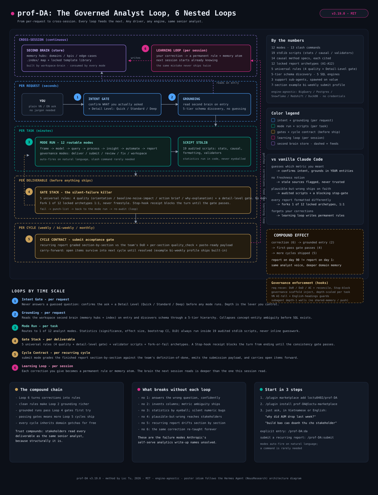

# prof-DA

**prof-DA turns Claude Code into a disciplined data analyst that anyone can drive, analyst or not.** Ask for a number, a chart, a root cause, or a stakeholder report, in Vietnamese or English, and it runs a fixed, governed analyst workflow instead of improvising, so the answer is consistent, checkable, and reads the same every time.

- **What it is:** a Claude Code plugin that wraps Claude in 12 analyst modes (`frame -> model -> query -> process -> insight -> automate -> report`, plus `deliver` / `submit` / `review` / `fix` / `workspace`) behind one natural-language entry point.
- **Who it's for:** not only data analysts and analytics engineers. It is built so **business stakeholders and non-technical users can self-serve data** and still get an analyst-grade result, and so the experts get rigor and consistency instead of improvisation. The aim is **consistent, high-quality, trustworthy self-serve output**, first and foremost for <organization> stakeholders.
- **The problem it kills:** a stock LLM guesses which metric you meant, queries a schema it never checked, returns a bare number with no signal-vs-noise read, and formats every report differently. Plausible-but-wrong answers slip through. Nothing is reproducible.
- **The guarantee:** any session, on any engine, driven by anyone, produces work that reads like the same senior analyst made it.

`v3.19.0` · MIT · engine-agnostic: BigQuery / Postgres / Snowflake / Redshift / DuckDB

## The whole system on one page



Read it like a clock: a request flows down the lanes (intent gate -> grounding -> mode run -> gate stack -> cycle contract), the learning loop writes what it learned back into the second brain, and the next request starts deeper than the last. The compound chain is the product.

**New here?** [docs/GUIDE.md](docs/GUIDE.md) is the full written walkthrough — every mode, the enforcement spine, how it auto-fires, and the self-operating maintenance loops (curator / hard memory budget / anti-drift / subagent walls) derived from studying Hermes Agent.

## Why this matters now

Anthropic's own write-up, [How Anthropic enables self-service data analytics with Claude](https://claude.com/blog/how-anthropic-enables-self-service-data-analytics-with-claude), shows Claude can already automate roughly 95% of business analytics queries, but **only once the foundation exists**: canonical data, a semantic source-of-truth, encoded skills, and validation. The same piece names the parts that stay hard: **concept-entity ambiguity** (a question maps to "hundreds of viable options"), **data staleness** ("definitions and schemas change constantly"), **retrieval failure**, and **silent failures**, the plausible answers that are simply wrong, which it flags as still unsolved.

So the differentiator is no longer "can the agent query data." Vanilla Claude can run the steps. prof-DA is the layer that **operationalizes that blueprint for a real org**: it ships the skills, the validation, the consistency, and the grounding so you do not rebuild them every session, and so a non-expert's self-serve answer is one you can actually trust. The three things it adds beyond vanilla Claude are next.

## Where prof-DA fits the blueprint

The blog's stack has four tiers: **Data Foundations** (modeled, tested, fresh tables), **Sources of Truth** (the semantic layer, lineage, and a business knowledge base, i.e. the ground truth), **Skills** (the encoded procedural knowledge that actually runs an analysis), and **Validation** (the checks that catch the plausible-but-wrong answer).

**prof-DA is the Skills + Validation layer, the enabler and executioner.** It ships the encoded skills (the 12 modes) and the validation spine (the universal rules, the audited scripts, the gates, the reconcile pass) so a non-expert's self-serve answer runs to one standard and can be trusted, without rebuilding any of it per session. This is the layer the blog calls the source of the 21% -> 95% accuracy jump.

**What prof-DA does NOT build yet, by design:** the foundation tiers, Data Foundations and the Sources of Truth (the semantic layer, the ground truth, the domain knowledge base). prof-DA **consumes** them through the workspace second brain when they exist (it reads your curated memory + index to ground every mode), but standing them up is a separate data-modeling / analytics-engineering process today, not part of prof-DA.

**Roadmap:** close the loop end to end, so a DA/AE can build the domain knowledge base and the semantic source-of-truth **with** prof-DA, not just consume a pre-built one, turning it from the executioner of the blueprint into a partner for standing the whole blueprint up.

## What makes prof-DA different

Three layers vanilla Claude leaves you to build yourself. Each maps onto a failure mode above.

### 1. The build-once-lock report protocol: 12 archetypes, fork-or-fail

Every deliverable **forks one of 12 locked report archetypes (A1-A12) 1:1** and swaps in data; it never freestyles a layout. The set covers the full DA surface: **A1** deep-dive, **A2** ops dashboard, **A3** editorial paper, **A4** daily email, **A5** Google Chat card, **A6** slide deck (the IA pin), **A7** exec one-pager, **A8** idea-verification, **A9** training, **A10** data-quality, **A11** projection, and **A12** slide-deck / editable-PPTX. They share one design contract: a token palette, the verdict vocabulary, the chart-choice matrix, and the AI-tell bans, all governed by a build-once-then-lock playbook.

Why it matters: per-report style drift is the tell of an untrustworthy self-serve tool. When every output reads like the same senior analyst made it, a business stakeholder can trust it at a glance, with no analyst in the loop. `report` mode enforces fork-or-fail (a README-only template stub triggers a design handoff, never a freestyle). See [storytelling-with-data](skills/da/references/storytelling-with-data.md) and [output-slide-deck](skills/da/references/output-slide-deck.md); the locked archetype library lives in your workspace's `shared/templates/` (the A1-A12 set is <organization>'s reference instantiation).

### 2. The workspace second brain: consolidated, current, per-task

`workspace` mode **builds and maintains** a second brain: a clean taxonomy, a memory layer of your domains, metrics, conventions, and past decisions, and a navigable index that **every other mode reads on entry**. The agent starts grounded in your real entities instead of guessing them.

But a memory that only grows rots, so the brain is kept **current and consolidated**, not written once and forgotten. A curator pass merges duplicate notes and surfaces orphans; freshness and staleness checks flag knowledge that has drifted from its source; the index is rebuilt as files move; and a reconcile loop confirms what actually changed. The result is one up-to-date, de-duplicated knowledge layer the agent can trust on every task, instead of a growing pile of stale notes. The conventions, rules, and hooks that govern how work is filed and retrieved are part of this layer too, so the workspace stays operated to one standard rather than ad-hoc per session.

Why it matters: this is the direct answer to the blog's three open problems. Grounding in curated domain memory collapses **concept-entity ambiguity**; the index makes the right context **retrievable** instead of lost; the maintain + consolidate + freshness loop fights **staleness** continuously, not once. Division of labor: the standalone `workspace-brain` skill builds, seeds, and curates the brain; prof-DA consumes it on every mode entry. See [mode-workspace](skills/da/references/mode-workspace.md).

### 3. The enforcement layer: a rule-governed, PM-grade work environment

The hardest unsolved problem is the plausible wrong answer, and an ordinary agent has no defense: it answers from a blank context, calls it done, and moves on. prof-DA replaces that with a **rule-governed environment that runs every task the way a project manager would** - with a spec, a definition of ready and of done, acceptance criteria, durable work-in-progress state, and a reconcile pass before anything is called finished. This per-task discipline, not just the report rules, is the layer a vanilla LLM does not have. What binds **every** task:

- **A per-task contract, injected, not optional.** Before work starts, each ask carries a **Definition of Ready** (inputs and access available, scope explicit, ambiguity surfaced), a **Definition of Done**, and **Acceptance Criteria**, scaled to the Quick / Standard / Deep depth you pick (and at Deep an Epic -> Feature -> Story + RAID breakdown). A heavy request is self-chunked, delegated under depth-1 walls, then re-integrated by one accountable writer.
- **Layered specs + a work cache.** Intent is pinned as a just-enough spec (a frame charter, a metric contract, a section contract) the build is verified against, and work-done / work-in-progress is cached to disk (durable receipts + an append-only requirements ledger) so a long, compacted session never silently drops an ask.
- **5 universal rules** on the deliverable (orientation, baseline-noise-impact, action brief, why-explanation, all behind a Detail-Level gate) + **19 audited statistics scripts**, so numbers are computed, never eyeballed.
- **Verify, don't assume, then doubt, then reconcile.** A task is not done until proven: an evidence ladder (a run output, a rendered artifact on disk, a corrected real number, never "seems right") plus an anti-rationalization checklist that blocks the excuses an agent uses to skip a hard step, plus a **doubt pass** before any high-stakes claim ships, an adversarial self-review that actively tries to DISPROVE the result (CLAIM -> EXTRACT -> DOUBT -> RECONCILE, bias-to-disprove, no rubber-stamp) rather than confirm it. An independent pass then diffs the delivered work against the captured asks (MET / PARTIAL / MISSED) before "done" is allowed.
- **Chunked, reversible delivery.** A multi-step build runs as 1 task = 1 commit + a per-task verify gate, stopping on the first failure or any irreversible step (a push, a send, a schema cutover).
- **Continuous staleness control.** When one asset changes, a staleness-trace re-syncs every dependent (doc, plan, AC/DoD, output); freshness governance flags stale data before it is trusted.

Hooks make all of this non-skippable: a per-prompt pass injects the contract, a Stop-hook blocks a turn from ending until the deliverable passes its gate and the asks are reconciled, and a learning loop turns each correction you give into a permanent rule. A wrong-but-pretty answer has to survive every one of them. Detail in [What it enforces](#what-it-enforces).

## Why not just vanilla Claude Code?

Same questions, sharpened against the failure modes Anthropic's blog names:

| The hard part | Vanilla Claude Code | prof-DA |
|---|---|---|
| Concept-entity ambiguity | Guesses which metric you meant | Confirms intent, grounds in the workspace second brain, discovers the real schema (5-tier) before any query |
| Data staleness | No freshness notion | Freshness governance + a maintained memory/index; stale sources are flagged, not trusted |
| Silent failures (plausible-but-wrong) | "Looks done," trusted on faith | Audited stat scripts + a Stop-hook consistency gate; no bare numbers (baseline-noise-impact on every figure) |
| Style drift / inconsistency | Formats every report differently | Forks one of 12 build-once-locked archetypes 1:1 |
| Forgets corrections | Repeats the mistake next session | Learning loop turns a correction into a permanent rule |

## Install

Claude Code marketplaces use a 2-step pattern (like `apt-add-repository` then `apt install`):

```bash
# Step 1 - register the marketplace (once per machine)
/plugin marketplace add loctu0402/prof-DA

# Step 2 - install the plugin from it
/plugin install prof-DA@loctu-marketplace

# Verify
/plugin list      # prof-DA 3.19.0 should appear
```

Both steps are required. If Step 2 returns `Marketplace "loctu-marketplace" not found`, Step 1 was skipped.

```bash
/plugin update prof-DA@loctu-marketplace        # update
/plugin uninstall prof-DA                        # remove the plugin
/plugin marketplace remove loctu-marketplace     # optional: drop the registry too
```

Upgrading from the old `prof-data-analyst` package (v3.3 or earlier)? Uninstall it first, then install `prof-DA`; the namespace and repo were both renamed. Details in [CHANGELOG.md](CHANGELOG.md).

## First run

You usually do not type a command. Just ask, in Vietnamese or English:

```
cho mình tỷ lệ user mới giữ lại sau 30 ngày, tháng vừa rồi
why did AUM drop last week?
build báo cáo doanh thu cho stakeholder
```

prof-DA detects the request, confirms intent and a detail level (Quick / Standard / Deep), routes to the right mode, and runs. To start explicitly, use the entry command:

```
/prof-DA:da     # confirm intent + detail level, then route to a mode
```

## The 12 modes, in two groups

The modes split into two layers. **Execution modes** run the analysis itself, left to right along the six-phase lifecycle (ask, prepare, process, analyze, share, act). **Governance modes** are cross-cutting: invoke them any time to enforce the binding rules and review-discipline checks, fix the work, finalize it to a contract, and systematize the whole workspace and work process into a second brain. A non-technical user never learns these names: they ask in plain language and prof-DA routes, confirms intent, and runs the right one.

### Execution modes, the 6-phase analysis lifecycle

Phase to mode: **Ask** = frame | **Prepare** = model + query | **Process** = process | **Analyze** = insight | **Share** = report | **Act** = automate.

| Phase | Mode | What it does | Sample natural triggers |
|-------|------|--------------|-------------------------|
| **Ask** | **frame** | Scope a vague ask into a locked plan: business understanding, metric contract, data plan. Outputs `PLANNING.md`. | "không biết bắt đầu", "stakeholder muốn", "metric nào phù hợp" |
| **Prepare** | **model** | Design the warehouse: Kimball star, dbt staging-to-marts, Medallion, or DuckDB layered, with table contracts. | "design DWH", "build mart", "dbt project" |
| **Prepare** | **query** | Natural language to SQL with schema discovery, a cost-safety check, and a logic card. | "cho mình số liệu", "lấy data", "breakdown theo Y", "compare X vs Y" |
| **Process** | **process** | Raw to staged to cleaned to mart, with 6-step EDA and a summary per phase; the home of predictive modeling. | "EDA", "data quality", "feature engineering", "forecast" |
| **Analyze** | **insight** | Hypothesis to diagnostic to recommendation: matches the right causal method and guards against bias. | "tại sao X giảm", "root cause", "vì sao", "phân tích sâu" |
| **Share** | **report** | Build a stakeholder deliverable from a locked template: storyline, chart anatomy, dual-comparison KPIs, portal publish. | "build báo cáo", "làm dashboard", "làm slide", "convert sang PPTX" |
| **Act** | **automate** | Operationalize it: a scheduled pipeline with fail-alerts, cache discipline, and backfill. | "automation", "schedule job", "chạy hàng ngày", "alert khi lỗi" |

### Governance modes, review and finalize and systematize

Cross-cutting; run any time, on any work (the binding-rules, review-discipline, and workspace-systematization layer).

| Mode | What it does | Sample natural triggers |
|------|--------------|-------------------------|
| **deliver** | Run an approved build as a gated autonomous loop (build-auto): spec-or-STOP, clean baseline, single batch approval, per-task RED to GREEN to build to commit + verify gate, stop-on-error/risk, evidence summary. | "build it autonomously", "chunk and commit per task", "/build auto" |
| **submit** | Final acceptance gate before a recurring report goes to a team's submission system: completeness audit vs the section contract, route gaps to the builder, per-section quality_check, emit a ready-to-paste payload. | "submit report", "finalize trước khi nộp", "đã đủ mục chưa" |
| **review** | Audit or re-sync. 5 sub-modes: A0 brief snapshot, A delivery refine, B full project audit, C stakeholder questioning, D staleness trace (after a change, sync every dependent asset). | "review report", "OK chưa", "audit project", "sửa xong sync giúp" |
| **fix** | Surgically debug a pipeline or report, with a patch-ceiling escalation rule. | "fix pipeline", "report sai", "wrong number", "pipeline fail" |
| **workspace** | Scaffold, organize, and index a whole workspace into the second brain, then keep it consolidated and current. Guide-first for non-technical users; secrets-first, safe `git mv` on a branch. | "dọn workspace", "organize my workspace", "rebuild index" |

Each mode auto-fires on phrases like these, so a command is rarely needed; the full trigger lists live in each mode's `SKILL.md`. For deeper structure, `frame` runs 4 planning gates and `model` offers 4 warehouse patterns: see [mode-frame](skills/da/references/mode-frame.md) and [mode-model](skills/da/references/mode-model.md).

## What it enforces

Every deliverable passes 5 universal rules (4 quality rules plus a Detail-Level entry gate), and every task is run under a per-task governance contract. This is what keeps output consistent and rigorous across sessions and across whoever is driving, the way a project manager keeps a team to standard.

1. **Orientation block:** every deliverable opens with a short framing (SCQR, a 3-line intro, or a module docstring) so the reader gets the point before the detail.
2. **Baseline, noise, impact:** every number is stated against a baseline, checked for whether it is real or noise, then given an impact verdict. No bare figures.
3. **5W1H action brief:** every recommendation fills 8 fields (question, goal, what, why, who, when, where, how) so it is actionable, not vague.
4. **Why-explanation:** every action, method, threshold, and tool choice carries an inline reason (causal, empirical, comparative, theoretical, or operational). A circular "X because X" is rejected.

The **Detail-Level Gate** sits in front of all four: every mode confirms Quick / Standard / Deep before running. Depth is the lever you control. The plugin deliberately does not surface time estimates, because LLMs routinely mis-estimate duration.

**The per-task governance contract.** Beyond the deliverable's shape, prof-DA runs each task with project-manager discipline, the cutting-edge layer a blank-context agent lacks. Every ask is captured with a **Definition of Ready** (can we start: inputs, access, scope, surfaced ambiguity), a **Definition of Done**, and **Acceptance Criteria**, scaled to the chosen depth (Epic -> Feature -> Story + RAID at Deep). Intent is pinned in a just-enough spec; work-done and work-in-progress are cached to disk (durable receipts + an append-only requirements ledger) so nothing is dropped across a compaction. A task is "done" only on evidence (a run, a rendered artifact on disk, a corrected number, never "seems right"), and an independent reconcile pass diffs the delivered work against the captured asks (MET / PARTIAL / MISSED) first. Multi-step builds run 1 task = 1 commit with a per-task verify gate and stop on the first failure or irreversible step; when one asset changes, a staleness-trace re-syncs its dependents. See `execution-discipline`, `evidence-based-done`, `build-auto`, and `delivery-lifecycle` in the references.

On top of the rules sit a 5-criteria quality check and a 5-gate quality pipeline (scope -> data -> analysis -> visuals -> review). Stakeholder visuals follow Storytelling-with-Data discipline (action titles, grey plus one accent, no pie or 3D): see [storytelling-with-data](skills/da/references/storytelling-with-data.md).

For recurring, structured reports (weekly / bi-weekly / monthly), an optional **section contract** pins the required sections and grades each against its own definition-of-done; the `submit` mode runs that gate and emits the submission payload before the report leaves for the team manager or system. The shipped <product> bi-weekly profile is the worked instantiation. See [recurring-report-contract](skills/da/references/recurring-report-contract.md).

Hooks make these non-optional rather than advisory. A per-prompt pass **injects the per-task contract** (DoR / DoD / AC, scaled by depth) so it behaves like a system prompt the agent cannot skip. A **Stop-hook** blocks a turn from ending until the deliverable passes its consistency gate and the captured asks are reconciled (the model cannot quietly skip validation or leave an ask half-done). A **learning loop** captures your corrections at session end and updates the rule the agent reads next time, so a repeated mistake becomes a permanent fix instead of a recurring one. Some of these forcing-functions live in the host workspace's hook layer; prof-DA wires into them and ships its own in-plugin copies of the discipline so the behavior holds even standalone.

## What is inside

prof-DA is one root skill plus thin per-mode stubs, a script stdlib, method specs, and 3 support agents. The deep material lives in the linked files; this README stays a map.

```
skills/
  da/                      root skill: rules, protocols, references
    references/            deep docs (modes, methods, governance, SWD, schema)
    scripts/               19 stdlib scripts (run, never inline, statistics)
  frame, model, query ...  12 thin mode stubs that load the root skill
commands/                  13 slash commands (1 entry + 12 modes)
agents/                    3 support sub-agents
```

- **19 stdlib scripts** (`skills/da/scripts/`): stats (effect size, significance, MDE, bootstrap CI, multiple testing), causal (DiD / event study, parallel-trends), formatting, and validators (orientation, action brief, AI-tell scan, rubric audit, method-maturity audit, report consistency, section-contract, artifact-presence, anti-rationalization, self-check). Script-over-agent-compute is a hard rule: statistics always run in a vetted script, never guessed inline. See [scripts-guide](skills/da/references/scripts-guide.md).
- **14 method specs** (`skills/da/references/methods/`): DiD, event study, RDD, synthetic control, PSM, IV, bootstrap CI, robustness, sensitivity, falsification, multiple testing, post-hoc power, cross-validation, pre-registration. Each cites a primary source. See [methods/_index](skills/da/references/methods/_index.md).
- **3 support sub-agents** (`agents/`), spawned only when value beats cost: `da-orchestrator` (intent + plan + final-review gate), `da-context-tracer` (multi-file reads for big-project review), `da-method-auditor` (causal-method judgment).

## Configuration

prof-DA is engine-agnostic and ships no credentials. It adapts to:

| Layer | Options |
|-------|---------|
| SQL engine | BigQuery, Postgres, Snowflake, Redshift, DuckDB |
| Semantic layer | Cube.js, dbt-metrics, LookML, or org-specific |
| Notifications | SMTP, Slack, Teams, PagerDuty, internal module |
| Scheduler | Airflow, Dagster, Prefect, cron, GitHub Actions |

Schema discovery follows a 5-tier hierarchy (owner-curated tag -> catalog API -> access-aware metadata -> INFORMATION_SCHEMA -> sampling): see [schema-source-hierarchy](skills/da/references/schema-source-hierarchy.md). Workspace-specific settings (project IDs, credentials, brand themes) live outside the plugin.

**<organization> users:** an optional extension bundles the Semantic Cube, the <org-data-mcp> and <org-catalog> MCPs, OpenMetadata curation, and the A1-A12 house slide/report skin. See [org-extensions](skills/da/references/org-extensions.md). Everyone else can ignore it.

## A reference standard

prof-DA hard-codes no engine, schema, or brand, and ships no credentials. The <organization> stack (Semantic Cube, the <org-data-mcp> and <org-catalog> MCPs, OpenMetadata, the A1-A12 house templates) is the **first instantiation**, isolated in [org-extensions](skills/da/references/org-extensions.md); everything else is portable.

The intent is bigger than one plugin. prof-DA is meant as a **reference blueprint for the canonical agentic data workflow** (intent-gating, schema discovery, audited statistics, grounded memory, locked deliverables, enforced validation) that any future agentic data assistant, on any stack and for any org, can adopt and instantiate. <organization> is where it was proven first; the workflow is the part meant to outlive it.

## Versioning

Current version `3.19.0`. Full history, including the v3.4 rename from `prof-data-analyst`, is in [CHANGELOG.md](CHANGELOG.md).

## Contributing

Issues and pull requests are welcome at [loctu0402/prof-DA](https://github.com/loctu0402/prof-DA). prof-DA is distilled from one analyst's daily practice, so real-world gaps and counter-examples are the most useful feedback.

## License

MIT. See [LICENSE](LICENSE).

## Author

Method by Loc Tu (loctu), 2026. Distilled from personal practice.
